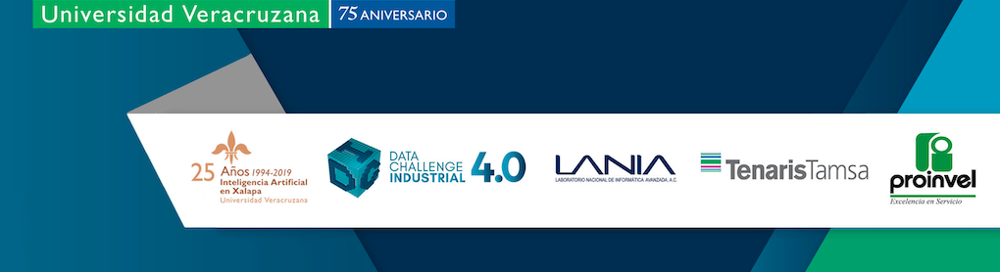

# Taller de Python Data Challenge Industrial

Este repositorio contiene las libretas para el Taller de Python Data Challenge Industrial que se lleva a cabo como parte del evento [Data Challenge Industrial 4.0](www.lania.mx/dci). El material está basado en el libro [Python Data Science Handbook](http://shop.oreilly.com/product/0636920034919.do) de Jake VanderPlas; el contenido original está disponible [en GitHub](https://github.com/jakevdp/PythonDataScienceHandbook).

## Acerca del Taller

Este taller surge como una propuesta de valor adicional a la experiencia del Data Challenge Industrial. El Comite Organizador detecto un area de oportunidad para promover el lenguaje de programacion Python en el contexto de su aplicacion para el analisis de datos en busca de soluciones a problemas que permean a la Industria Mexicana. En ocasiones anteriores el Taller ha sido posible gracias al generoso apoyo de la [Python Software Foundation](http://psf.org) a traves de una beca para la realizacion del Taller.

El objetivo del Taller es dar una introduccion general al ecosistema del lenguaje de programacion utiles para el analisis de dato, en particularl [IPython](http://ipython.org), [NumPy](http://numpy.org), [Pandas](http://pandas.pydata.org), [Scikit-Learn](http://scikit-learn.org), y librerias relacionadas, asi como aplicaciones especificas basadas en problemas industriales. 

## Software

El Taller se realiza usando [Colab](https://colab.research.google.com/) de Google, ya que reduce el tiempo de instalacion y preparacion de requisitos necesarios para poder comenzar a usar el lenguaje de programacion cuanto antes. Puede usarse en un entorno de ejecucion local [siguiendo las instrucciones del sitio original](https://github.com/jakevdp/PythonDataScienceHandbook).

## Licencia
Se respeta la licencia original del autor la cual se reproduce integramente a continuacion.

### Code
The code in this repository, including all code samples in the notebooks listed above, is released under the [MIT license](LICENSE-CODE). Read more at the [Open Source Initiative](https://opensource.org/licenses/MIT).

### Text
The text content of the book is released under the [CC-BY-NC-ND license](LICENSE-TEXT). Read more at [Creative Commons](https://creativecommons.org/licenses/by-nc-nd/3.0/us/legalcode).
